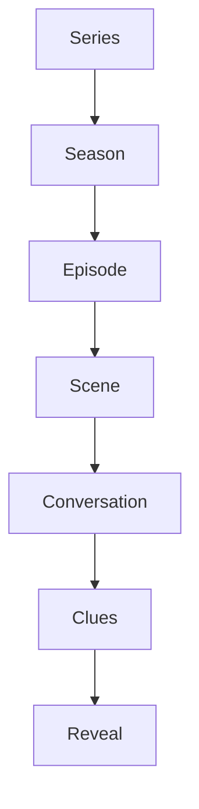

# Rate My Bites Story Architecture

This document is the internal contract for building the game as an ongoing television-style series without coupling story content to gameplay code.

## Content hierarchy

### Series

The Series defines the durable premise: recurring friends, gathering places, shared meals, and mysteries that reveal how people know one another. It owns the ordered list of Season IDs.

### Season

A Season groups a location and period of the friends’ lives. Its record owns:

- stable ID, title, location, and description
- main and recurring cast IDs
- restaurant IDs
- ordered episode timeline
- private story notes

Sprint 3.1 implements only `season-001` (Huntsville and North Alabama). Future locations remain ideas, not data or UI.

### Episode

An Episode is a complete, optional mystery. It owns:

- series metadata and Season membership
- cast IDs and canonical Character Bible references
- briefing, ordered scenes, clue moments, and emotional ending
- restaurant/menu choices and answer truth
- reveal language, completion payoff, and teaser
- optional newcomer-safe continuity

Episodes never own character portraits or restaurant identities. They resolve those from `worldBible.js`.

### Scene

A Scene is one ordered story beat. It may be conversation, reaction, confessional, Pup guidance, an interruption, or another supported presentation kind. A scene has a stable ID, speaker/camera context, natural dialogue, and optional influence or memory metadata.

### Conversation

Conversation carries personality first and clue delivery second. It should sound like longtime friends: contractions, interruptions, shared shorthand, affectionate teasing, and small details. Avoid lines that exist only to explain the plot.

### Clues

Clues are authored evidence attached to people, scenes, recent context, or the group decision. They support the existing restaurant and order predictions; they do not create a new mechanic. Correct answers remain explicit gameplay data rather than being parsed from prose.

### Reveal

The Reveal judges the existing predictions, explains the people’s choices, preserves the 300-point scoring model, and ends with a character-centered payoff. Episode Complete then provides the next safe action and a short television-style teaser.

## Canonical Bibles

`worldBible.js` is the single source of truth for:

- Series and Seasons
- recurring and guest characters
- recurring restaurants
- all production artwork
- preserved Fresh Variant artwork manifests

Character fields include identity, fixed portrait, home city, occupation, personality, food/drink preferences, signature order, relationships, running jokes, appearances, notes, and future ideas. Restaurant fields include identity, fixed artwork, signature dishes, traditions, jokes, appearances, and notes.

These Bibles are internal authoring infrastructure and must not be rendered as a raw UI.

## Continuity rule

Continuity is optional flavor, never a dependency:

1. The author supplies a returning-player line and a standalone line.
2. Completion progress selects the branch.
3. Both branches communicate the same current-episode idea.
4. Neither branch may contain evidence required to solve the mystery.

## Data flow

1. `worldBible.js` validates canonical people, places, seasons, and assets.
2. `episodes.js` resolves canonical names and artwork paths, then validates story/gameplay alignment.
3. `multiEpisode.js` selects the episode and resolves optional continuity from existing completion IDs.
4. The historical engine runs unchanged scoring, predictions, reveals, persistence, and progression.
5. `sprint31.js` renders the shared completion experience and navigation.

## Authoring boundaries

- Stable IDs are persistence and continuity contracts.
- Returning people and places reuse the same IDs and artwork.
- No runtime portrait selection or randomization.
- No episode-specific scoring, navigation, or completion renderer.
- No prior episode required.
- No future Season implementation until separately scoped.
- No save schema changes for story-only growth.
